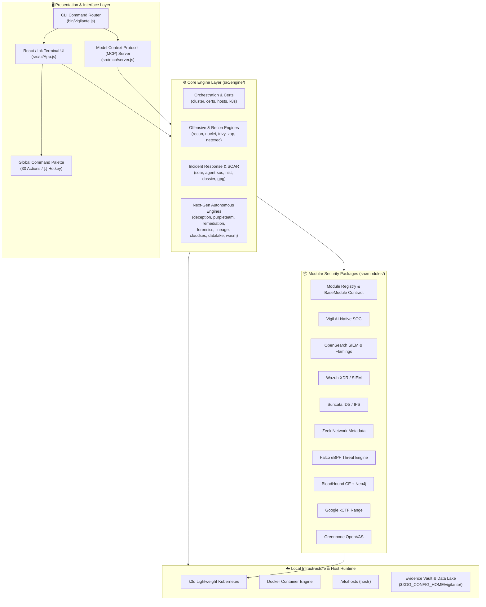
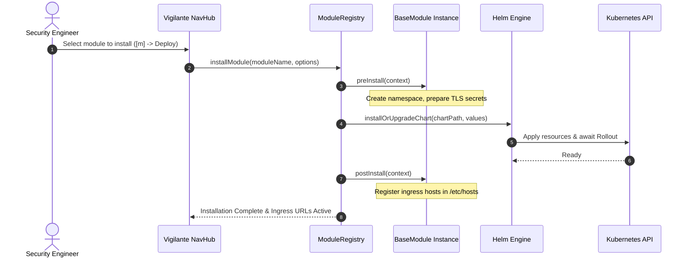
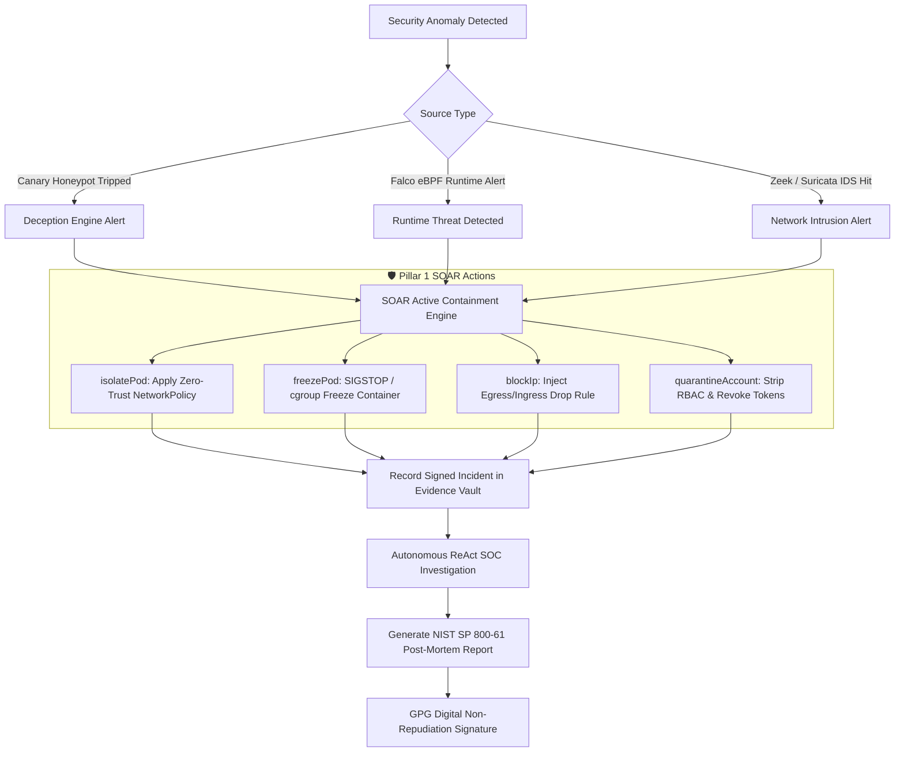

# 🏛️ Vigilante: System Architecture & Design Manual

This document provides a comprehensive technical breakdown of the architecture, subsystems, and data flows powering **Vigilante**, a modern terminal-native Cyber Defense, Incident Response, and Modular SOC Operations Platform built with React, Ink, and Node.js.

---

## 1. High-Level Architectural Blueprint

Vigilante is structured into four decoupled architectural layers, ensuring that infrastructure orchestration, detection engines, module packaging, and interactive user interfaces operate with clean boundaries:



---

## 2. Core Architectural Pillars

### Pillar 1: Local Cluster & Infrastructure Orchestration
- **Container Runtime**: Orchestrates local single- or multi-node Kubernetes clusters inside Docker via **k3d**, binding host ports `80` and `443` to Traefik/ingress load balancers.
- **Automated TLS Injection (`mkcert`)**: Generates an operating-system-trusted root Certificate Authority (CA) and wildcard certificates (`*.vigilante.local`), injecting them dynamically into Kubernetes TLS secrets.
- **Idempotent DNS Sync (`hostr`)**: Synchronizes `/etc/hosts` with managed entries inside a safe, isolated block (`# BEGIN VIGILANTE MANAGED HOSTS`), requesting `sudo` elevation only when changes are required.
- **Safe Kubernetes Pipeline (`k8s.js`)**: Executes idempotent manifest applications, validates CRD readiness, and monitors rollouts with customizable timeout guards.

---

### Pillar 2: Modular Security Stack (`BaseModule` System)
Vigilante enforces a strict plugin contract through [`BaseModule`](file:///mnt/unreal/git/DeployCoop/vigilante/src/modules/base.js). Modules declare their dependencies, Helm charts, ingress definitions, and lifecycle hooks:



---

### Pillar 3: Offensive Security, Posture & Reconnaissance Engines
- **NastyMap 2.0**: Builds real-time attack graph overlays, maps potential lateral movement paths between pods, and renders standalone headless SVG and interactive HTML reports.
- **Targeted Scanners**:
  - `recon.js`: Passive and active subnet discovery, CIDR calculation, and port sweeping.
  - `nuclei.js`: ProjectDiscovery template-based vulnerability assessment.
  - `trivy.js`: Container image and local filesystem CVE scanning with severity filtering.
  - `kubeaudit.js`: Pod Security Standards (Privileged, Baseline, Restricted) compliance evaluation.
  - `netexec.js`: Automated SMB/WinRM credential verification and network protocol testing.
  - `zap.js`: OWASP Zed Attack Proxy web application spidering and active scanning.
  - `oobscan.js`: Out-of-band hardware management scanning (BMC, IPMI 2.0, Redfish, RAKP-2 hash dumping for Hashcat).

---

### Pillar 4: Next-Gen Autonomous Cyber Defense & Incident Response

#### A. Autonomous Deception Mesh ("Canary Kube")
Deploys enticing decoy ServiceAccounts, deceptive Kubernetes Secrets containing tracking tokens, and decoy network honeypots (SMB, SSH, Redis, MSSQL). Any access attempt trips an audit sensor and triggers automated containment.

#### B. Autonomous Purple Team Arena
Runs multi-agent adversarial simulations pitting an automated Red Team agent (executing MITRE ATT&CK techniques across Reconnaissance, Credential Access, Lateral Movement, and Exfiltration) against a Blue Team ReAct SOC agent. Calculates Mean Time to Detect (MTTD) and Mean Time to Remediate (MTTR).

#### C. Self-Healing Auto-Remediator
Analyzes security audit findings, generates standard unified diff patches for Kubernetes manifests and Dockerfiles (stripping `privileged: true`, enforcing non-root users, pinning digest hashes), and produces automated Git Pull Request scripts with timestamped backups.

#### D. Deep PCAP Forensics & Protocol Reconstruction
Carves embedded files from HTTP and SMB packet payloads with MD5/SHA256 checksums, ingests `SSLKEYLOGFILE` session keys for TLS stream decryption, reconstructs full TCP streams, and renders ASCII flow ladder sequence diagrams.

#### E. Kernel-Native eBPF Process Lineage Tree
Constructs hierarchical process ancestry trees from system execution events and detects container escape breakouts, unauthorized reverse shells (`T1059.004`), and Living-off-the-Land Binaries (LOLBins).

#### F. Multi-Cloud Workload Identity & CSPM
Audits AWS IRSA, GCP Workload Identity, and Azure Client ID annotations on cluster ServiceAccounts, flags over-privileged IAM bindings, and evaluates cloud storage exposure.

#### G. High-Throughput Embedded Security Data Lake
Provides in-process SQL analytics over normalized security events (Falco, Zeek, Suricata, Audit, Canary). Operates with zero dependencies via built-in `node:sqlite` (`DatabaseSync`), with optional dynamic adapter support for official DuckDB. Enables retrospective threat hunting against newly synchronized CTI indicators.

#### H. WebAssembly (Wasm) Plugin Engine
Loads and executes sandboxed Wasm bytecode modules compiled from Rust, Go, or AssemblyScript with strict memory boundaries to evaluate network and host anomalies.

---

## 3. Incident Response & SOAR Containment Flow



---

## 4. Evidence Vault & Legal Chain-of-Custody

All forensic evidence, triage captures, scan outputs, and incident reports are stored under the user's XDG Base Directory structure:

```text
$XDG_CONFIG_HOME/vigilante/
├── config.yaml               # Global settings, cluster defaults, and active theme
├── evidence/                 # Incident Response Evidence Vault
│   └── <network-cidr>/       # Subnet partition (e.g., 10.42.0.0_24)
│       └── <host-ip>/        # Host directory (e.g., 10.42.0.77)
│           ├── triage.json   # Full forensic bundle (ping, mtr, dns, tls, http, arp)
│           ├── triage.json.asc # GPG detached cryptographic signature
│           └── payload.pcap  # Raw packet captures
├── nmaps/                    # Raw XML and text Nmap reconnaissance scans
├── oobscans/                 # Out-of-band hardware management (IPMI/BMC) scan records
├── cti/                      # Threat intelligence feeds and compiled Suricata rules
├── kspm/                     # Kubernetes posture scorecards and audit reports
├── canary/                   # Registered deception tokens and honeypots
├── carved/                   # Forensically carved files and artifacts
├── datalake/                 # Embedded security data lake (events.db / events.duckdb)
├── purpleteam/               # Purple team wargame simulation reports
└── wasm/                     # WebAssembly detection plugins (.wasm)
```

### Cryptographic Non-Repudiation
Every forensic capture and post-mortem report is cryptographically signed using GPG detached signatures (`.asc`). When an incident is analyzed or audited, `verifyFileSignature` validates that evidence has remained un-tampered since acquisition, guaranteeing legal chain-of-custody.

---

## 5. Terminal User Interface (TUI) Architecture

The interactive terminal interface is engineered using **React 18** and **Ink 4**:

- **No-JSX Runtime Compliance**: All UI views in `src/ui/` use pure `React.createElement(...)` calls, enabling native Node.js ESM execution without Babel or build-step compilation friction.
- **Central Navigation Hub (`NavHub.js`)**: Accessible via `[Tab]` from any view, presenting an indexed grid of 25 distinct operational actions.
- **Global Command Palette (`CommandPalette.js`)**: Accessible via `[:]` or `[/]`, offering fuzzy searching across 30 operational workflows.
- **Context-Sensitive Keyboard Menu (`MenuBar.js`)**: Dynamically adapts the bottom status bar to show contextual shortcuts for the active subview.
- **Subprocess Suspension**: Seamlessly suspends the Ink terminal rendering loop when launching external editors (`$EDITOR`) for Helm values editing, resuming terminal state cleanly upon exit.
- **Mouse & Clipboard Support (`ClipboardManager.js`)**: Supports SGR extended mouse tracking and multi-platform clipboard copying (OSC 52 escape sequences, `xclip`, `wl-copy`, `pbcopy`).

---

## 6. Model Context Protocol (MCP) Server Architecture

Vigilante embeds a full-featured **Model Context Protocol (MCP)** server (`src/mcp/server.js`) compliant with `@modelcontextprotocol/sdk`:

- **Transport**: Standard Input/Output (`stdio`), enabling native integration with AI environments like Claude Desktop, Google Antigravity, and Cursor.
- **Callable Tools (54)**: AI models can trigger diagnostics, run vulnerability scans, inspect Kubernetes pods, query the security data lake, deploy canary tokens, execute purple team simulations, and enforce SOAR active containment.
- **Static Resources (16)**: Direct access to cluster status, module lists, configuration profiles, threat catalogs, and evidence vaults via `vigilante://` URI schemes.
- **Parameterized Resource Templates (5)**: Dynamic querying of specific hosts (`vigilante://hosts/{hostIp}`), evidence bundles (`vigilante://evidence/{network}/{hostIp}`), and OOB scan reports.
