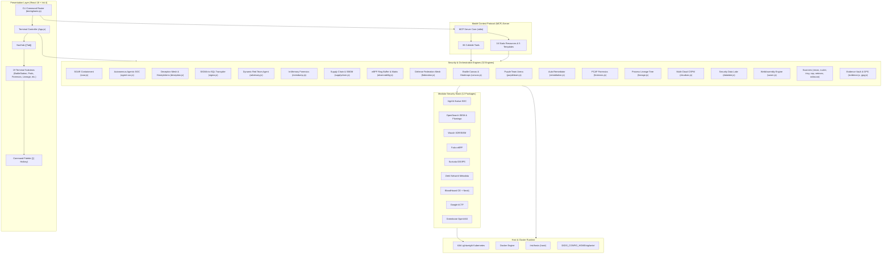
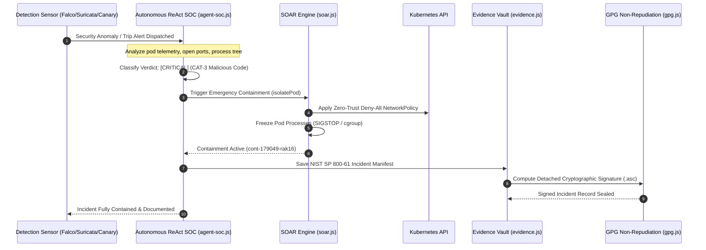
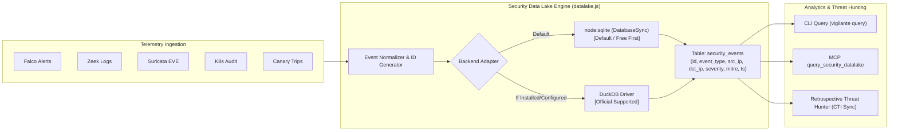
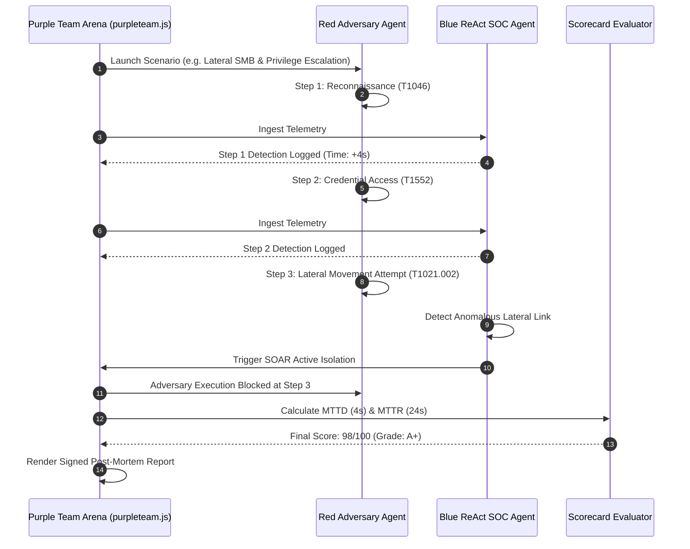

# 🏗️ Vigilante: System Design & Architectural Blueprint

This document details the production design, subsystem boundaries, data models, and architectural patterns of **Vigilante**, a modular, terminal-native Cyber Defense, Incident Response, and Modular SOC Operations Platform built with React, Ink, and Node.js.

---

## 1. Design Principles & Goals

1. **Terminal-Native Ergonomics**: Complete cyber defense, triage, threat hunting, and incident remediation accessible entirely within a high-performance terminal UI without requiring a web browser.
2. **Modular Micro-Package Architecture**: Every security service is an isolated module extending `BaseModule`, with decoupled Helm charts and custom values overrides.
3. **Sub-Second Active Containment (SOAR)**: When a critical threat or honeypot trip is detected, programmatic zero-trust isolation policies are enforced within milliseconds.
4. **Legal Chain-of-Custody**: All forensic captures, triage dumps, and post-mortems are persisted in an immutable evidence vault backed by GPG detached digital signatures.
5. **Zero-Friction Zero-Dependency Baseline**: High-throughput embedded SQL data lakes and Wasm detectors run out-of-the-box using the Node.js standard library, while gracefully scaling to official enterprise tooling (such as DuckDB) when available.
6. **AI & LLM Interoperability**: Every asset, scan, topology map, and containment action is exposed to AI agents via the Model Context Protocol (MCP).

---

## 2. Global System Architecture

---

## 3. Data Flow & Execution Pipelines

### A. Autonomous Incident Response & Active Containment

---

### B. High-Throughput Security Data Lake Pipeline

---

### C. Autonomous Purple Team Simulation Pipeline

---

## 4. Key Subsystem Specifications

### 1. Storage & State Architecture
Vigilante adopts the standard XDG Base Directory specification:
- **`$XDG_CONFIG_HOME/vigilante/config.yaml`**: Configuration preferences, default domain, theme.
- **`$XDG_CONFIG_HOME/vigilante/evidence/`**: Multi-tenant evidence tree partitioned by network CIDR and host IP.
- **`$XDG_CONFIG_HOME/vigilante/datalake/`**: Persistent embedded database (`events.db` or `events.duckdb`).
- **`$XDG_CONFIG_HOME/vigilante/canary/`**: Catalog of active canary honeytokens and decoy pods.
- **`$XDG_CONFIG_HOME/vigilante/carved/`**: Extracted files and reconstructed stream payloads.

### 2. Multi-Cluster Isolation & Instance Tracking
Multiple k3d cluster instances can coexist without port or state collisions:
- Every instance records its metadata in [`src/engine/instances.js`](file:///mnt/unreal/git/DeployCoop/vigilante/src/engine/instances.js).
- Cluster state, certificates, and DNS entries are tagged with the specific cluster name (default: `vigilante-dev`).

### 3. Model Context Protocol Specification
The MCP server in `src/mcp/server.js` exposes:
- **54 Tools**: Spanning cluster management, vulnerability scanning, active containment, data lake querying, and posture auditing.
- **16 Static Resources**: Directly addressing cluster configurations, pod tables, evidence vaults, and NastyMap graphs via `vigilante://` URIs.
- **5 Parameterized Resource Templates**: For on-demand host profiles and evidence file inspection.
